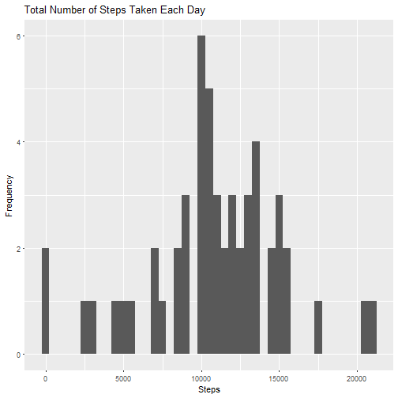
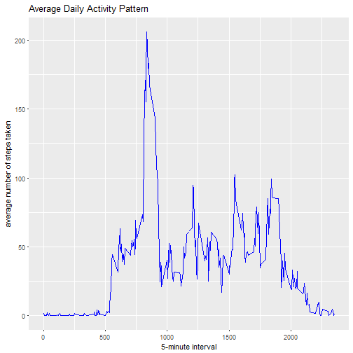
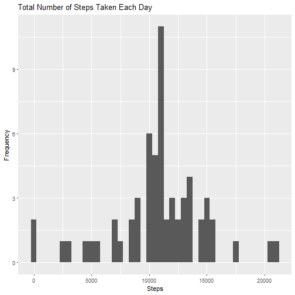
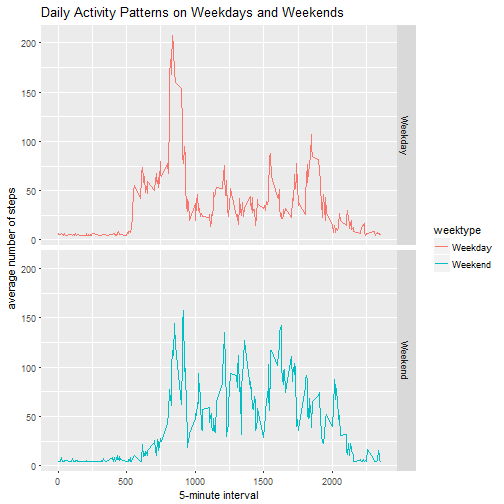

# Reproducible Research Course Project 1
Sarah Guo
7/26/2017

## Loading and preprocessing the data

```r
library(knitr)
opts_chunk$set(echo=TRUE)
```

```r
setwd("D:/Google Drive/stats begins here/Data Science -John Hopkins/Course 5 Reproducible Research/Week 2 lecture/Project 1")
fileUrl<-"https://d396qusza40orc.cloudfront.net/repdata%2Fdata%2Factivity.zip"
download.file(fileUrl,destfile="activity.zip")
dateDownloaded<-date()
unzip("activity.zip")

act<-read.csv("activity.csv",header=TRUE)
```
The dataset was downloaded on Wed Jul 26 16:49:31 2017.

## What is mean total number of steps taken per day?

**Here is a histogram of the total number of steps taken each day.**


```r
eachday<-aggregate(steps~date,act,sum,na.rm=TRUE)
library(ggplot2)
qplot(steps,data=eachday,binwidth=500,xlab="Steps",ylab="Frequency")+labs(title="Total Number of Steps Taken Each Day")
```



**Mean and median of the total number of steps taken per day**


```r
meansteps<-mean(eachday$steps,na.rm = TRUE)
mediansteps<-median(eachday$steps,na.rm = TRUE)
```
*The mean of the total number of steps taken per day was 1.0766189 &times; 10<sup>4</sup>.*

*The median of the total number of steps taken per day was 10765.*

## What is the average daily activity pattern?

**Here is a time series plot showing average daily activity pattern.**


```r
avinterval<-aggregate(steps~interval,act,mean,na.rm=TRUE)
ggplot(avinterval,aes(interval,steps))+geom_line(col="blue")+xlab("5-minute interval")+ylab("average number of steps taken")+labs(title="Average Daily Activity Pattern")
```



**Which 5-minute interval, on average across all the days in the dataset, contains the maximum number of steps?**

```r
minterval<- avinterval[which.max(avinterval$steps),]
kable(minterval,digits=1)
```


|    | interval| steps|
|:---|--------:|-----:|
|104 |      835| 206.2|

##Imputing missing values

**Calculate total number of missing values in the dataset**


```r
N<-sum(is.na(act$steps))
```
*The total number of missing values in the dataset was 2304.*

**Devise a strategy for filling in all of the missing values in the dataset.Create a new dataset that is equal to the original dataset but with the missing data filled in with column mean.**


```r
act1<-act
act1$steps[which(is.na(act1$steps))]<-mean(act1$steps,na.rm=TRUE)
```

**Here is a histogram of the total number of steps taken each day using the new dataset.**


```r
eachday1<-aggregate(steps~date,act1,sum)
qplot(steps,data=eachday1,binwidth=500,xlab="Steps",ylab="Frequency")+labs(title="Total Number of Steps Taken Each Day")
```



**mean and median of the total number of steps taken per day**

```r
meansteps1<-mean(eachday1$steps)
mediansteps1<-median(eachday1$steps)
```
*The mean of the total number of steps taken per day was 1.0766189 &times; 10<sup>4</sup>*

*The median of the total number of steps taken per day was 1.0766189 &times; 10<sup>4</sup>*

*The mean and median are different from the estimates from the first part of the assignment.*

*The mean is equal to median after filling in the missing values.*

## Are there differences in activity patterns between weekdays and weekends?

**Create a new factor - weekend/weekday**


```r
library(dplyr)
```

```
## Warning: package 'dplyr' was built under R version 3.4.1
```

```
## 
## Attaching package: 'dplyr'
```

```
## The following objects are masked from 'package:stats':
## 
##     filter, lag
```

```
## The following objects are masked from 'package:base':
## 
##     intersect, setdiff, setequal, union
```

```r
act1$date<-as.Date(act1$date,"%Y-%m-%d")
act1<- act1%>%
  mutate(weektype= ifelse(weekdays(act1$date)=="Saturday" | weekdays(act1$date)=="Sunday", "Weekend", "Weekday"))
```

```
## Warning: package 'bindrcpp' was built under R version 3.4.1
```

**Make a ggplot containing a time series plot of the 5-minute interval (x-axis) and the average number of steps taken, averaged across all weekday days or weekend days (y-axis)**


```r
avinterval1<-aggregate(steps~interval+weektype,act1,mean)
ggplot(avinterval1,aes(interval,steps,color=weektype))+geom_line()+facet_grid(weektype~.)+xlab("5-minute interval")+ylab("average number of steps")+labs(title="Daily Activity Patterns on Weekdays and Weekends")
```




